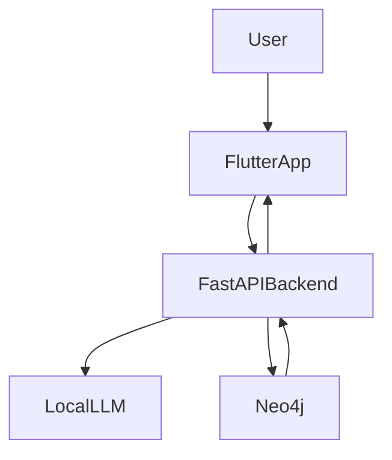

## LoopBreaker Overview

LoopBreaker is a journaling assistant that detects unhelpful mental/behavioral loops (like stress or procrastination), logs them in a Neo4j graph, and offers lightweight interventions to help you “break the loop” in real time.

### High-level Architecture

- **Flutter frontend**: Collects user input, displays risk level and interventions, and shows a history dashboard.
- **FastAPI backend**: Classifies journal entries via a local LLM, records entries in Neo4j, detects loops, and returns interventions.
- **Local LLM (Ollama)**: Performs the text classification into psychological states.
- **Neo4j**: Stores entries, detected states, interventions, and outcomes as a graph.

### System Diagram

### Main Flows

- **Journal analysis**
  - User types a journal entry in the Flutter app and taps **Analyze State**.
  - Frontend calls `POST /analyze` with the text.
  - Backend queries the local LLM, logs the state in Neo4j, and returns the detected node, confidence, and risk level.
  - If a loop is detected, backend also returns an intervention title and task.

- **Loop intervention**
  - When a loop is detected, the frontend shows an intervention dialog (e.g., a breathing exercise).
  - User can indicate whether the intervention helped, which is sent via `POST /feedback`.
  - Backend records the outcome in Neo4j.

- **History dashboard**
  - History screen calls `GET /history` to fetch the latest entries, interventions, and outcomes.
  - The dashboard shows stats, a trend chart of confidence, and a list of recent entries.

- **Reset journey**
  - User can reset all recorded entries/interventions/outcomes via `DELETE /reset`.
  - Backend deletes the relevant nodes from Neo4j.

